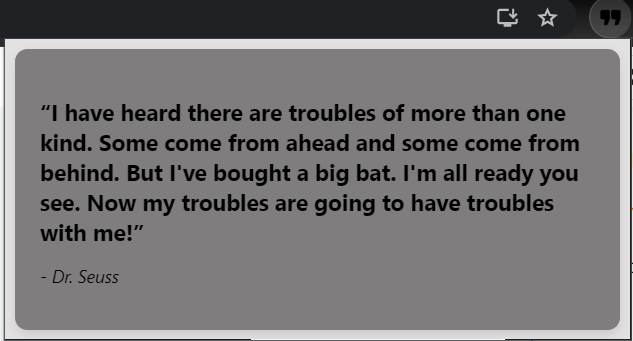
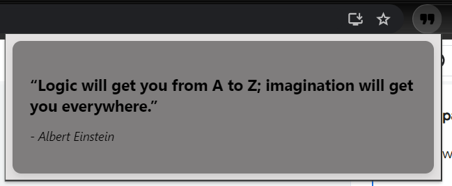

# Quotify

This project is a demonstration of web scraping using Puppeteer to fetch quotes from "https://quotes.toscrape.com" and then storing them in a JSON file. Additionally, it includes the creation of a Chrome extension to display random quotes fetched from the stored data.

## Web Scraping with Puppeteer

Puppeteer is a Node library which provides a high-level API over the Chrome DevTools Protocol. It allows for headless automation of web browsing and is particularly useful for web scraping tasks.

### Getting Started

To start scraping quotes from "https://quotes.toscrape.com" using Puppeteer:

1. Clone this repository.
2. Install Node.js if you haven't already.
3. Install Puppeteer using npm:

```bash
npm install puppeteer
```

4. Run the web scraping script:

```bash
node index.js
```

This script will visit the website, extract quotes, authors, and then store them in a JSON file.

## Chrome Extension for Random Quotes

This part of the project involves creating a Chrome extension to display random quotes fetched from the stored JSON file.
Here is an example of how it looks

<p align="center">
  
  
</p>

### Getting Started

To set up the Chrome extension:

1. Navigate to `chrome://extensions/` in your Chrome browser.
2. Enable Developer mode.
3. Click on "Load unpacked" and select the `chrome-extension` directory from this repository.

### Usage

Once the extension is loaded, you can click on its icon in the Chrome toolbar to display a random quote.

## Conclusion

This project showcases the use of Puppeteer for web scraping and building a simple Chrome extension to utilize the scraped data. Feel free to explore and extend it further according to your requirements!

Happy coding! 🚀
